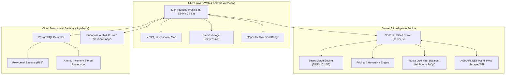
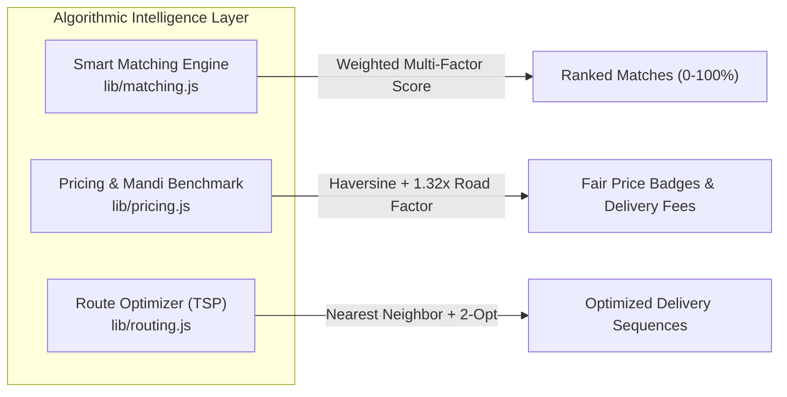

# FarmLink - Full Technology Stack Architecture

## 1. Overview & Architecture Diagram

FarmLink is a direct farm-to-buyer agricultural marketplace platform engineered for web and mobile (Android APK). It is designed with zero middleman margin, authentic AGMARKNET Mandi reference pricing, algorithmic buyer-farmer matching, atomic inventory management, and multi-stop delivery route optimization.

---

## 2. Frontend & User Interface

| Technology / Component | Version / Spec | Purpose & Implementation Details |
| :--- | :--- | :--- |
| **Core Language** | Modern JavaScript (ES6+) | Vanilla SPA architecture without heavy framework overhead. Reactive state container pattern (`S` store), hash routing (`#/farmer/...`, `#/buyer/...`), and template literals for component rendering. |
| **Styling & Theming** | CSS3 / Custom Properties | Token-based dynamic theming with **Cosmic Latte** (`#B7A89A`), **Deep Burgundy** (`#722F37`), and **Mocha Cream** (`#E8DCC6`). Supports light and dark mode toggling. |
| **Responsive Engine** | CSS Grid + Flexbox + Fluid `clamp()` | Dynamic viewport scaling across 320px–1200px+ without breakpoint snapping; full viewport-safe inset management (`env(safe-area-inset-top)`, `env(safe-area-inset-bottom)`). |
| **Mapping & Geospatial** | Leaflet.js `1.9.4` + OpenStreetMap | Interactive tile maps for live delivery GPS tracking, order routing visualization, and farm-buyer geo-coordinate distance computation. |
| **Image Compression** | HTML5 Canvas 2D Context | Client-side JPEG/WebP compression to reduce upload payload sizes for crop harvest photos before cloud persistence. |
| **Typography** | Google Web Fonts | `Fraunces` (Editorial Serif for brand and headings), `Plus Jakarta Sans` & `Figtree` (Geometric Sans-serif for UI readability). |
| **Icons & Visuals** | Inline SVG Icon System | Handcrafted SVG icon library (50+ agricultural, logistics, and transactional icons) rendered with zero external icon font dependencies. |

---

## 3. Mobile & Cross-Platform (Android APK)

| Technology / Component | Version / Spec | Purpose & Implementation Details |
| :--- | :--- | :--- |
| **Mobile Runtime** | Capacitor `8.5.2` | Cross-platform runtime packaging the web app into a high-performance native Android WebView app (`com.farmlink.app`). |
| **Capacitor Plugins** | `@capacitor/app` (`8.1.2`), `@capacitor/status-bar` (`8.0.4`), `@capacitor/core` (`8.5.2`) | Native Android lifecycle handling (hardware back button minimization, Android status bar styling, safe-area inset binding). |
| **Android Framework** | Android SDK 36 (Android 16), AndroidX | Target Android platform using `BridgeActivity` and Material/SplashScreen base themes (`styles.xml`). |
| **Build Toolchain** | Gradle `8.14.3`, Android Gradle Plugin `8.9+`, OpenJDK 21 / Android JBR | Native APK compilation pipeline (`assembleDebug`, `assembleRelease`). |
| **Asset Automation** | Python 3 + Pillow | `generate_icons.py` script automatically generating all Android mipmap densities (`mdpi`, `hdpi`, `xhdpi`, `xxhdpi`, `xxxhdpi`). |

---

## 4. Backend Server & APIs

| Technology / Component | Version / Spec | Purpose & Implementation Details |
| :--- | :--- | :--- |
| **Runtime Environment** | Node.js (v24 LTS) | Fast, lightweight server with asynchronous I/O and zero unnecessary server-side dependencies. |
| **HTTP Server Engine** | Native `http` & `https` modules | Custom request router handling CORS, body parsing, static file serving with MIME caching, and RESTful JSON endpoints. |
| **Mandi Price Service** | `lib/agmarknet.js` | Integration fetching official Government of India AGMARKNET mandi modal prices with caching and district fallbacks. |
| **Live Tracking Service** | `server.js` (`/api/tracking`) | In-memory real-time driver coordinate repository tracking latitude, longitude, speed, and ETA per active order. |

---

## 5. Database, Authentication & Security (Supabase Cloud)

| Technology / Component | Version / Spec | Purpose & Implementation Details |
| :--- | :--- | :--- |
| **Database Engine** | PostgreSQL 15+ | Relational data store hosting users, listings, orders, requirements, bids, and reviews. |
| **Data Access Client** | `@supabase/supabase-js` `2.49.1` | JavaScript SDK managing PostgREST requests, realtime subscriptions, and JWT sessions. |
| **Row Level Security (RLS)** | PostgreSQL RLS Policies | Strict table access boundaries preventing unauthenticated data scraping or unauthorized order modifications. |
| **Concurrency Control** | Atomic PL/pgSQL Functions | Stored functions ensuring stock quantities decrement atomically during simultaneous checkouts, eliminating race conditions. |
| **Custom Auth Bridge** | `lib/api.js` | Dual-mode authentication supporting password hashing, token validation, role-based access (Farmer vs Buyer), and session persistence. |

---

## 6. Algorithmic Intelligence Engines

### 1. Smart Match Engine (`lib/matching.js`)
Calculates an objective match score ($0–100\%$) between buyer procurement requirements and live farmer produce listings:
- **Price Competitiveness (35%)**: Evaluates deal pricing relative to current mandi reference benchmarks.
- **Quantity Alignment (30%)**: Matches required harvest volume against available farmer stock.
- **Geographic Proximity (20%)**: Computes Euclidean/Haversine distance between farm origin and delivery destination.
- **Produce Quality & Grade (10%)**: Weighs organic certification, grade rating (A/B/C), and freshness indicators.
- **Seller Reliability (5%)**: Factoring farmer review scores and completed delivery history.

### 2. Pricing & Delivery Engine (`lib/pricing.js`)
- **Haversine Distance**: Computes great-circle distance between coordinates with a calibrated Indian road tortuosity factor ($1.32\times$).
- **Dynamic Logistics Fee**: Base charge + distance slab rates + weight tonnage multipliers.
- **Mandi Price Indicator**: Real-time comparison badge labeling listings as *Below Mandi*, *Mandi Fair Price*, or *Above Mandi*.

### 3. Route Optimizer (`lib/routing.js`)
- Solves the multi-stop delivery route optimization problem using the **Nearest-Neighbor Heuristic** followed by **2-Opt iterative improvements** to untangle crossing paths and minimize fuel consumption for farmer logistics runs.

---

## 7. Testing & Quality Assurance

| Tool / Framework | Type | Details |
| :--- | :--- | :--- |
| **Node.js Native Test Runner** | Unit, Integration & Security Tests | Executed via `node --test tests/*.test.js` covering 22 comprehensive test suites. |
| **Test Coverage Scope** | Multi-Domain | Validates AGMARKNET live fetching, 5-factor smart matching scoring, atomic stock decrement contracts, RLS security barriers, session invalidation, and multi-stop route optimization. |
| **Responsive Layout Testing** | Device Viewports | Multi-resolution testing across 320x640, 360x800, 375x812, 390x844, 412x915, and 430x932 screens. |
